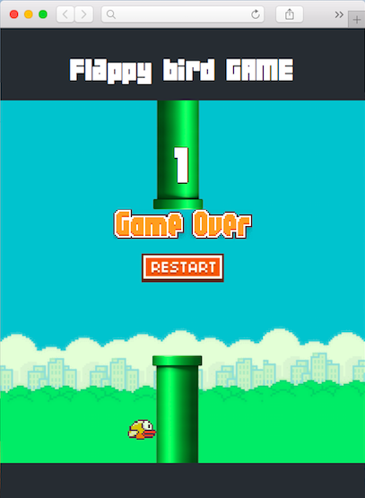

# Flappy Bird Game
Flappy Bird est un jeu web (ordinateur, tablet, mobile) développé sur HTML, CSS et JQUERY.
Le jeu consiste à contrôler un oiseau qui essaie de voler entre des rangées de tuyaux verts sans les toucher. L’oiseau a toujours tendance à tomber et toucher le seul. La scène se déplace latéralement (jeu en 2D) de droite à gauge. A chaque fois que l’oiseau traverse un tuyau on gagne un point sur le score et la vitesse du jeu augmente. Pour faire voler l’oiseau vous devez maintenir appuyé la barre d’espace du clavier.

### Comment ça marche
Pour jouer Flappy Bird il suffit de:<br>
```
git clone https://github.com/sarastef/flappyBird.git
Lancer le fichier index.html sur votre navigateur préféré.
```
## GAME: 


## Live FlappyBird GAME

[DEMO](http://flappybirdgame.tp.mmi-lepuy.fr/)


